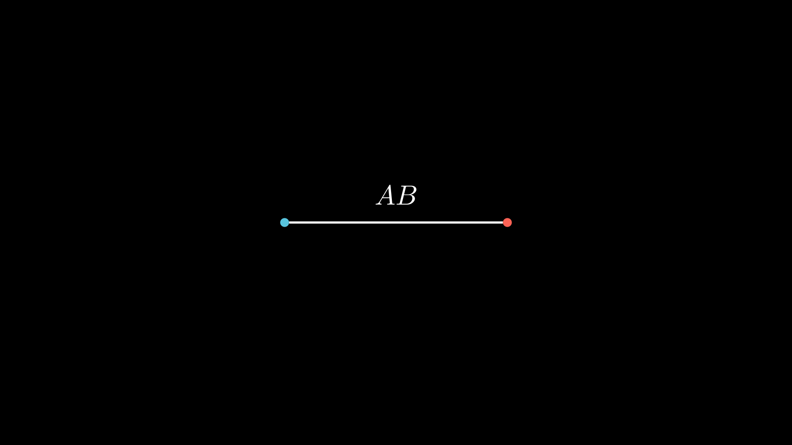
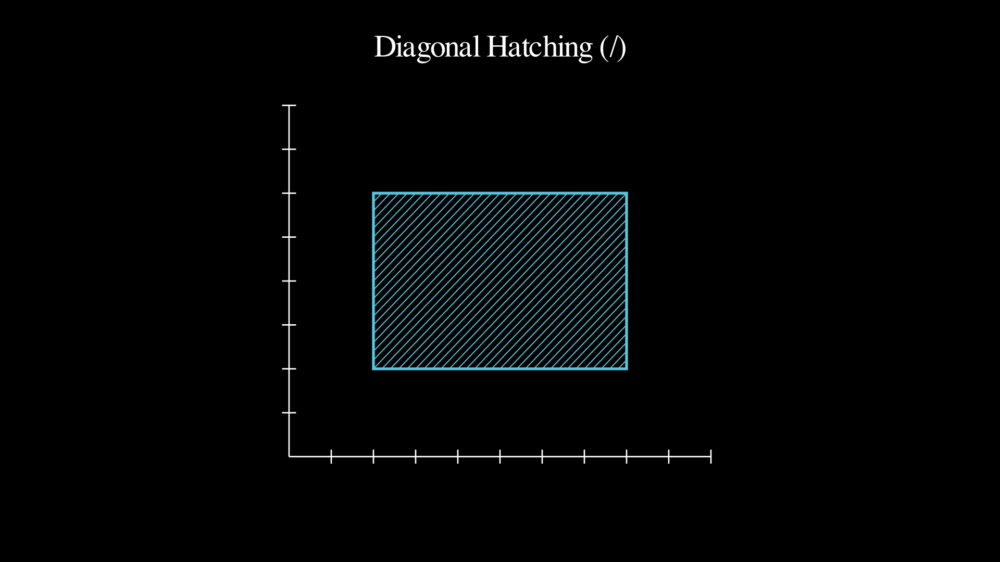

# Robo Manim Add-ons - Complete Demos Index

This document provides a comprehensive index of all demonstration scenes with code snippets, reference images, and video links.

## Table of Contents
- [Geometry Demos](#geometry-demos)
- [Annotation Demos](#annotation-demos)
- [Labels Demos](#labels-demos)
- [Intersection Demos](#intersection-demos)

---

## Geometry Demos

### 1. PerpDemo
**Description:** Demonstrates the `perp()` function for creating perpendicular lines.

**Code:**
```python
from manim import *
from robo_manim_add_ons import perp

class PerpDemo(Scene):
    def construct(self):
        # Create a horizontal reference line
        ref_line = Line(LEFT * 3, RIGHT * 3, color=BLUE)
        ref_line_label = Text("Reference Line", font_size=24).next_to(ref_line, DOWN)

        # Create a dot at origin
        dot = Dot(ORIGIN, color=RED)
        dot_label = Text("Dot", font_size=20).next_to(dot, UP, buff=0.2)

        # Create perpendicular line with mid placement
        perp_line = perp(ref_line, dot, length=4.0, placement="mid")
        perp_line.set_color(GREEN)
        perp_label = Text("Perpendicular Line", font_size=24).next_to(perp_line, RIGHT)

        # Animate
        self.play(Create(ref_line), Write(ref_line_label))
        self.wait(0.5)
        self.play(Create(dot), Write(dot_label))
        self.wait(0.5)
        self.play(Create(perp_line), Write(perp_label))
        self.wait(2)
```

**Reference Image:**


**Video:**
[PerpDemo.mp4](demos/geometry/PerpDemo.mp4)

**Run Command:**
```bash
manim -pql examples/geometry/geometry_demo.py PerpDemo
```

---

### 2. ParallelDemo
**Description:** Demonstrates the `parallel()` function for creating parallel lines.

**Code:**
```python
from manim import *
from robo_manim_add_ons import parallel

class ParallelDemo(Scene):
    def construct(self):
        # Create a diagonal reference line
        ref_line = Line(LEFT + DOWN, RIGHT + UP, color=BLUE)
        ref_line_label = Text("Reference Line", font_size=24).next_to(ref_line, LEFT, buff=0.3)

        # Create a dot above the line
        dot = Dot(UP * 2, color=RED)
        dot_label = Text("Dot", font_size=20).next_to(dot, UP, buff=0.2)

        # Create parallel line with mid placement
        parallel_line = parallel(ref_line, dot, length=3.0, placement="mid")
        parallel_line.set_color(YELLOW)
        parallel_label = Text("Parallel Line", font_size=24).next_to(parallel_line, RIGHT, buff=0.3)

        # Animate
        self.play(Create(ref_line), Write(ref_line_label))
        self.wait(0.5)
        self.play(Create(dot), Write(dot_label))
        self.wait(0.5)
        self.play(Create(parallel_line), Write(parallel_label))
        self.wait(2)
```

**Reference Image:**


**Video:**
[ParallelDemo.mp4](demos/geometry/ParallelDemo.mp4)

**Run Command:**
```bash
manim -pql examples/geometry/geometry_demo.py ParallelDemo
```

---

### 3. PlacementDemo
**Description:** Shows different placement options (start, mid, end) for perpendicular lines.

**Code:**
```python
from manim import *
from robo_manim_add_ons import perp

class PlacementDemo(Scene):
    def construct(self):
        # Create horizontal reference line
        ref_line = Line(LEFT * 4, RIGHT * 4, color=BLUE)
        ref_label = Text("Reference", font_size=20).next_to(ref_line, DOWN, buff=0.3)

        # Create three dots at different heights
        dot_mid = Dot(ORIGIN, color=RED)
        dot_start = Dot(UP * 2, color=GREEN)
        dot_end = Dot(DOWN * 2, color=YELLOW)

        # Create perpendicular lines with different placements
        perp_mid = perp(ref_line, dot_mid, 2.0, placement="mid").set_color(RED)
        perp_start = perp(ref_line, dot_start, 2.0, placement="start").set_color(GREEN)
        perp_end = perp(ref_line, dot_end, 2.0, placement="end").set_color(YELLOW)

        # Show all elements
        self.play(Create(ref_line), Write(ref_label))
        self.play(Create(dot_mid), Create(perp_mid))
        self.play(Create(dot_start), Create(perp_start))
        self.play(Create(dot_end), Create(perp_end))
        self.wait(2)
```

**Reference Image:**


**Video:**
[PlacementDemo.mp4](demos/geometry/PlacementDemo.mp4)

**Run Command:**
```bash
manim -pql examples/geometry/geometry_demo.py PlacementDemo
```

---

### 4. GeometryComboDemo
**Description:** Demonstrates both `perp()` and `parallel()` functions together.

**Code:**
```python
from manim import *
from robo_manim_add_ons import perp, parallel

class GeometryComboDemo(Scene):
    def construct(self):
        # Create a diagonal line
        ref_line = Line(LEFT * 2 + DOWN, RIGHT * 2 + UP, color=BLUE)

        # Create perpendicular line
        dot = Dot(ORIGIN, color=RED)
        perp_line = perp(ref_line, dot, 3.0, placement="mid").set_color(GREEN)

        # Create parallel line at a different position
        dot2 = Dot(UP * 2 + LEFT, color=ORANGE)
        parallel_line = parallel(ref_line, dot2, 2.5, placement="mid").set_color(YELLOW)

        # Animate
        self.play(Create(ref_line))
        self.play(Create(dot), Create(perp_line))
        self.play(Create(dot2), Create(parallel_line))
        self.wait(2)
```

**Reference Image:**


**Video:**
[GeometryComboDemo.mp4](demos/geometry/GeometryComboDemo.mp4)

**Run Command:**
```bash
manim -pql examples/geometry/geometry_demo.py GeometryComboDemo
```

---

### 5. DynamicPerpExample
**Description:** Perpendicular line that updates dynamically as the base line rotates using `always_redraw`.

**Code:**
```python
from manim import *
from robo_manim_add_ons import perp

class DynamicPerpExample(Scene):
    def construct(self):
        # Create a base line that we'll animate
        base_line = Line(LEFT * 2, RIGHT * 2, color=BLUE)
        center_dot = Dot(ORIGIN, color=YELLOW)

        # Create a perpendicular line using always_redraw
        perp_line = always_redraw(
            lambda: perp(base_line, center_dot, length=3, placement="mid").set_color(RED)
        )

        # Show initial setup
        self.play(Create(base_line))
        self.play(FadeIn(center_dot))
        self.play(Create(perp_line))
        self.wait()

        # Rotate the base line - perpendicular updates automatically!
        self.play(Rotate(base_line, angle=PI/3, about_point=ORIGIN), run_time=3)
        self.wait()
```

**Reference Image:**


**Video:**
[DynamicPerpExample.mp4](demos/geometry/DynamicPerpExample.mp4)

**Run Command:**
```bash
manim -pql examples/geometry/dynamic_geometry_demo.py DynamicPerpExample
```

---

### 6. ParallelogramUpdater
**Description:** Dynamic parallelogram using parallel lines with updaters.

**Code:**
```python
from manim import *
from robo_manim_add_ons import parallel

class ParallelogramUpdater(Scene):
    def construct(self):
        # Base of parallelogram (movable)
        base = Line(LEFT * 2 + DOWN, RIGHT * 2 + DOWN, color=BLUE)
        top_left_dot = Dot(LEFT * 1.5 + UP, color=YELLOW)

        # Side connects base start to the moving dot
        side = always_redraw(
            lambda: Line(base.get_start(), top_left_dot.get_center(), color=BLUE)
        )

        # Top edge - parallel to base
        top = always_redraw(
            lambda: parallel(base, top_left_dot, length=base.get_length(),
                           placement="start").set_color(GREEN)
        )

        self.play(Create(base))
        self.play(FadeIn(top_left_dot))
        self.add(side, top)

        # Move the top-left dot - parallelogram adjusts
        self.play(top_left_dot.animate.move_to(LEFT * 2.5 + UP * 2), run_time=3)
        self.wait()
```

**Reference Image:**


**Video:**
[ParallelogramUpdater.mp4](demos/geometry/ParallelogramUpdater.mp4)

**Run Command:**
```bash
manim -pql examples/geometry/dynamic_geometry_demo.py ParallelogramUpdater
```

---

## Annotation Demos

### 1. BasicDistanceMarker
**Description:** Basic distance markers on a triangle using `distance_marker()`.

**Code:**
```python
from manim import *
from robo_manim_add_ons import distance_marker

class BasicDistanceMarker(Scene):
    def construct(self):
        # Create a triangle
        triangle = Polygon([-2, -1, 0], [2, -1, 0], [0, 2, 0], color=WHITE)

        # Add distance markers on each side
        marker_a = distance_marker(
            [-2, -1, 0], [2, -1, 0],
            label_text="a", color=BLUE, label_offset=0.4
        )
        marker_b = distance_marker(
            [2, -1, 0], [0, 2, 0],
            label_text="b", color=RED, label_offset=0.4
        )
        marker_c = distance_marker(
            [0, 2, 0], [-2, -1, 0],
            label_text="c", color=GREEN, label_offset=0.4
        )

        self.play(Create(triangle))
        self.play(Create(marker_a))
        self.play(Create(marker_b))
        self.play(Create(marker_c))
        self.wait(2)
```

**Reference Image:**


**Video:**
[BasicDistanceMarker.mp4](demos/annotation/BasicDistanceMarker.mp4)

**Run Command:**
```bash
manim -pql examples/annotation/annotation_demo.py BasicDistanceMarker
```

---

### 2. DistanceMarkerWithDots
**Description:** Using `distance_marker()` with Dot objects - positions automatically extracted.

**Code:**
```python
from manim import *
from robo_manim_add_ons import distance_marker

class DistanceMarkerWithDots(Scene):
    def construct(self):
        # Create Dot objects at different positions
        dot_a = Dot([-2, -1, 0], color=BLUE, radius=0.08)
        dot_b = Dot([2, -1, 0], color=RED, radius=0.08)
        dot_c = Dot([0, 2, 0], color=GREEN, radius=0.08)

        # Create triangle connecting dots
        triangle = Polygon(
            dot_a.get_center(), dot_b.get_center(), dot_c.get_center(),
            color=WHITE, stroke_width=2
        )

        # Create distance markers using Dot objects directly
        marker_ab = distance_marker(dot_a, dot_b, label_text="d_{AB}",
                                   color=PURPLE, label_offset=-0.5)
        marker_bc = distance_marker(dot_b, dot_c, label_text="d_{BC}",
                                   color=ORANGE, label_offset=0.4)
        marker_ca = distance_marker(dot_c, dot_a, label_text="d_{CA}",
                                   color=TEAL, label_offset=0.4)

        self.play(FadeIn(dot_a), FadeIn(dot_b), FadeIn(dot_c))
        self.play(Create(triangle))
        self.play(Create(marker_ab), Create(marker_bc), Create(marker_ca))
        self.wait(2)
```

**Reference Image:**


**Video:**
[DistanceMarkerWithDots.mp4](demos/annotation/DistanceMarkerWithDots.mp4)

**Run Command:**
```bash
manim -pql examples/annotation/annotation_demo.py DistanceMarkerWithDots
```

---

### 3. DistanceMarkerRectangle
**Description:** Annotating a rectangle with dimension markers.

**Code:**
```python
from manim import *
from robo_manim_add_ons import distance_marker

class DistanceMarkerRectangle(Scene):
    def construct(self):
        # Create rectangle
        rect = Rectangle(width=4, height=2.5, color=WHITE)
        corners = rect.get_vertices()

        # Width marker (bottom)
        width_marker = distance_marker(
            corners[2], corners[3],  # bottom_left to bottom_right
            label_text="4", color=BLUE, label_offset=-0.5
        )

        # Height marker (right)
        height_marker = distance_marker(
            corners[3], corners[0],  # bottom_right to top_right
            label_text="2.5", color=RED, label_offset=0.5
        )

        self.play(Create(rect))
        self.play(Create(width_marker))
        self.play(Create(height_marker))
        self.wait(2)
```

**Reference Image:**


**Video:**
[DistanceMarkerRectangle.mp4](demos/annotation/DistanceMarkerRectangle.mp4)

**Run Command:**
```bash
manim -pql examples/annotation/annotation_demo.py DistanceMarkerRectangle
```

---

### 4. PythagoreanTheorem
**Description:** Illustrating the Pythagorean theorem with distance markers.

**Code:**
```python
from manim import *
from robo_manim_add_ons import distance_marker

class PythagoreanTheorem(Scene):
    def construct(self):
        # Create right triangle
        triangle = Polygon(
            [-2, -1.5, 0],  # bottom left
            [2, -1.5, 0],   # bottom right
            [2, 1.5, 0],    # top right
            color=WHITE
        )

        # Add distance markers
        a_marker = distance_marker(
            [-2, -1.5, 0], [2, -1.5, 0],
            label_text="a = 4", color=BLUE, label_offset=-0.4
        )
        b_marker = distance_marker(
            [2, -1.5, 0], [2, 1.5, 0],
            label_text="b = 3", color=RED, label_offset=0.4
        )
        c_marker = distance_marker(
            [2, 1.5, 0], [-2, -1.5, 0],
            label_text="c = 5", color=GREEN, label_offset=0.4
        )

        formula = MathTex(r"a^2 + b^2 = c^2", font_size=40).to_edge(DOWN)

        self.play(Create(triangle))
        self.play(Create(a_marker), Create(b_marker), Create(c_marker))
        self.play(Write(formula))
        self.wait(2)
```

**Reference Image:**


**Video:**
[PythagoreanTheorem.mp4](demos/annotation/PythagoreanTheorem.mp4)

**Run Command:**
```bash
manim -pql examples/annotation/annotation_demo.py PythagoreanTheorem
```

---

### 5. BasicLabelDemo
**Description:** Simple label positioned between two points using `label()`.

**Code:**
```python
from manim import *
from robo_manim_add_ons import label

class BasicLabelDemo(Scene):
    def construct(self):
        # Two dots
        dot_a = Dot([-2, 0, 0], color=BLUE)
        dot_b = Dot([2, 0, 0], color=RED)

        # Line connecting them
        line = Line(dot_a, dot_b, color=WHITE)

        # Label positioned above the line
        ab_label = label("AB", dot_a, dot_b, buff=0.5)

        self.play(FadeIn(dot_a), FadeIn(dot_b))
        self.play(Create(line))
        self.play(FadeIn(ab_label))
        self.wait(2)
```

**Reference Image:**


**Video:**
[BasicLabelDemo.mp4](demos/annotation/BasicLabelDemo.mp4)

**Run Command:**
```bash
manim -pql examples/annotation/label_demo.py BasicLabelDemo
```

---

### 6. DiagonalHatchDemo
**Description:** Diagonal hatching pattern on a rectangle using `hatched_region()`.

**Code:**
```python
from manim import *
from robo_manim_add_ons import hatched_region

class DiagonalHatchDemo(Scene):
    def construct(self):
        # Create axes
        axes = Axes(
            x_range=[0, 10, 1], y_range=[0, 8, 1],
            x_length=6, y_length=5,
            axis_config={"include_tip": False}
        )

        # Define rectangle vertices
        vertices = [(2, 2), (8, 2), (8, 6), (2, 6)]

        # Create hatched region with diagonal lines
        hatched, boundary = hatched_region(
            axes, vertices,
            spacing=0.2, direction="/",
            color=BLUE, stroke_width=1.5
        )

        self.add(axes)
        self.play(Create(boundary))
        self.play(Create(hatched))
        self.wait(2)
```

**Reference Image:**


**Video:**
[DiagonalHatchDemo.mp4](demos/annotation/DiagonalHatchDemo.mp4)

**Run Command:**
```bash
manim -pql examples/annotation/hatched_region_demo.py DiagonalHatchDemo
```

---

### 7. TriangleHatchDemo
**Description:** Backslash hatching pattern on a triangle using `hatched_region()`.

**Code:**
```python
from manim import *
from robo_manim_add_ons import hatched_region

class TriangleHatchDemo(Scene):
    def construct(self):
        # Create axes
        axes = Axes(
            x_range=[0, 10, 1], y_range=[0, 8, 1],
            x_length=6, y_length=5,
            axis_config={"include_tip": False}
        )

        # Define triangle vertices
        vertices = [(2, 2), (8, 2), (5, 6)]

        # Create hatched region with backslash pattern
        hatched, boundary = hatched_region(
            axes, vertices,
            spacing=0.25, direction="\\",
            color=RED, stroke_width=1.5
        )

        self.add(axes)
        self.play(Create(boundary))
        self.play(Create(hatched))
        self.wait(2)
```

**Reference Image:**


**Video:**
[TriangleHatchDemo.mp4](demos/annotation/TriangleHatchDemo.mp4)

**Run Command:**
```bash
manim -pql examples/annotation/hatched_region_demo.py TriangleHatchDemo
```

---

## Labels Demos

### 1. DynamicVertexLabelsExample
**Description:** Vertex labels that update dynamically as triangle transforms using `vertex_labels()`.

**Code:**
```python
from manim import *
from robo_manim_add_ons import vertex_labels

class DynamicVertexLabelsExample(Scene):
    def construct(self):
        # Create a triangle
        triangle = Polygon([-2, -1, 0], [2, -1, 0], [0, 2, 0], color=BLUE)

        # Create vertex labels using always_redraw
        labels = always_redraw(
            lambda: VGroup(*vertex_labels(
                triangle, labels=["A", "B", "C"],
                scale=0.8, color=WHITE, buff=0.3
            ))
        )

        self.play(Create(triangle))
        self.play(FadeIn(labels))
        self.wait()

        # Scale the triangle - labels follow!
        self.play(triangle.animate.scale(1.5), run_time=2)
        self.play(Rotate(triangle, angle=PI/3, about_point=ORIGIN), run_time=2)
        self.wait()
```

**Reference Image:**


**Video:**
[DynamicVertexLabelsExample.mp4](demos/labels/DynamicVertexLabelsExample.mp4)

**Run Command:**
```bash
manim -pql examples/labels/dynamic_labels_demo.py DynamicVertexLabelsExample
```

---

### 2. DynamicEdgeLabelsExample
**Description:** Edge labels that update as polygon transforms using `edge_labels()`.

**Code:**
```python
from manim import *
from robo_manim_add_ons import edge_labels

class DynamicEdgeLabelsExample(Scene):
    def construct(self):
        # Create a square
        square = Square(side_length=3, color=GREEN)

        # Create edge labels using always_redraw
        labels = always_redraw(
            lambda: VGroup(*edge_labels(
                square, labels=["a", "b", "c", "d"],
                scale=0.7, color=YELLOW, buff=0.25
            ))
        )

        self.play(Create(square))
        self.play(FadeIn(labels))
        self.wait()

        # Rotate - labels stay perpendicular to edges!
        self.play(Rotate(square, angle=PI/4, about_point=ORIGIN), run_time=3)
        self.play(square.animate.scale(0.6), run_time=2)
        self.wait()
```

**Reference Image:**


**Video:**
[DynamicEdgeLabelsExample.mp4](demos/labels/DynamicEdgeLabelsExample.mp4)

**Run Command:**
```bash
manim -pql examples/labels/dynamic_labels_demo.py DynamicEdgeLabelsExample
```

---

### 3. DynamicVertexAndEdgeLabels
**Description:** Both vertex and edge labels updating together.

**Code:**
```python
from manim import *
from robo_manim_add_ons import vertex_labels, edge_labels

class DynamicVertexAndEdgeLabels(Scene):
    def construct(self):
        # Create a pentagon
        pentagon = RegularPolygon(n=5, color=PURPLE).scale(2)

        # Create both vertex and edge labels with always_redraw
        vertex_label_objects = always_redraw(
            lambda: VGroup(*vertex_labels(
                pentagon, labels=["V_1", "V_2", "V_3", "V_4", "V_5"],
                scale=0.6, color=WHITE, buff=0.35
            ))
        )
        edge_label_objects = always_redraw(
            lambda: VGroup(*edge_labels(
                pentagon, labels=["e_1", "e_2", "e_3", "e_4", "e_5"],
                scale=0.5, color=YELLOW, buff=0.2
            ))
        )

        self.play(Create(pentagon))
        self.play(FadeIn(vertex_label_objects), FadeIn(edge_label_objects))
        self.play(Rotate(pentagon, angle=2*PI/5, about_point=ORIGIN), run_time=3)
        self.wait()
```

**Reference Image:**


**Video:**
[DynamicVertexAndEdgeLabels.mp4](demos/labels/DynamicVertexAndEdgeLabels.mp4)

**Run Command:**
```bash
manim -pql examples/labels/dynamic_labels_demo.py DynamicVertexAndEdgeLabels
```

---

### 4. InteractivePolygonWithUpdater
**Description:** Interactive labels showing edge lengths that update with polygon transformations.

**Code:**
```python
from manim import *
from robo_manim_add_ons import vertex_labels, edge_labels

class InteractivePolygonWithUpdater(Scene):
    def construct(self):
        # Create a hexagon
        hexagon = RegularPolygon(n=6, color=RED).scale(2)

        # Edge labels showing calculated lengths
        edge_label_group = VGroup()

        def update_edge_labels(mob):
            vertices = hexagon.get_vertices()
            n = len(vertices)
            edge_lengths = []

            for i in range(n):
                p1 = vertices[i]
                p2 = vertices[(i + 1) % n]
                length = np.linalg.norm(p2 - p1)
                edge_lengths.append(f"{length:.1f}")

            mob.become(VGroup(*edge_labels(
                hexagon, labels=edge_lengths,
                scale=0.5, color=YELLOW, buff=0.25
            )))

        edge_label_group.add_updater(update_edge_labels)

        self.play(Create(hexagon))
        self.add(edge_label_group)
        self.play(hexagon.animate.scale(0.5), run_time=2)
        self.wait()

        edge_label_group.clear_updaters()
```

**Reference Image:**


**Video:**
[InteractivePolygonWithUpdater.mp4](demos/labels/InteractivePolygonWithUpdater.mp4)

**Run Command:**
```bash
manim -pql examples/labels/dynamic_labels_demo.py InteractivePolygonWithUpdater
```

---

### 5. MorphingPolygonLabels
**Description:** Labels that follow a morphing polygon (triangle to square).

**Code:**
```python
from manim import *
from robo_manim_add_ons import vertex_labels, edge_labels

class MorphingPolygonLabels(Scene):
    def construct(self):
        # Start with a triangle
        triangle = Polygon([-2, -1.5, 0], [2, -1.5, 0], [0, 2, 0], color=BLUE)
        square = Square(side_length=3, color=GREEN)

        # Labels for triangle
        vertex_label_objects = always_redraw(
            lambda: VGroup(*vertex_labels(
                triangle, labels=["A", "B", "C"][:len(triangle.get_vertices())],
                scale=0.7, color=WHITE, buff=0.3
            ))
        )
        edge_label_objects = always_redraw(
            lambda: VGroup(*edge_labels(
                triangle, labels=["a", "b", "c"][:len(triangle.get_vertices())],
                scale=0.6, color=YELLOW, buff=0.2
            ))
        )

        self.play(Create(triangle))
        self.add(vertex_label_objects, edge_label_objects)
        self.wait()

        # Transform to square
        self.play(Transform(triangle, square), run_time=3)
        self.wait()
```

**Reference Image:**


**Video:**
[MorphingPolygonLabels.mp4](demos/labels/MorphingPolygonLabels.mp4)

**Run Command:**
```bash
manim -pql examples/labels/dynamic_labels_demo.py MorphingPolygonLabels
```

---

## Intersection Demos

### 1. BasicIntersectionDemo
**Description:** Basic line-line intersection using `intersect_lines()`.

**Code:**
```python
from manim import *
from robo_manim_add_ons import intersect_lines

class BasicIntersectionDemo(Scene):
    def construct(self):
        # Create two intersecting lines
        line1 = Line(LEFT * 3, RIGHT * 3, color=BLUE)
        line2 = Line(DOWN * 2, UP * 2, color=GREEN)

        # Find intersection
        intersection_dot = intersect_lines(line1, line2)
        intersection_dot.set_color(RED).scale(1.5)

        self.play(Create(line1))
        self.play(Create(line2))
        self.wait(0.5)
        self.play(FadeIn(intersection_dot, scale=0.5))
        self.wait(2)
```

**Reference Image:**


**Video:**
[BasicIntersectionDemo.mp4](demos/intersection/BasicIntersectionDemo.mp4)

**Run Command:**
```bash
manim -pql examples/intersection/intersection_demo.py BasicIntersectionDemo
```

---

### 2. ParallelLinesDemo
**Description:** Demonstrates parallel lines (no intersection) detection.

**Code:**
```python
from manim import *
from robo_manim_add_ons import intersect_lines

class ParallelLinesDemo(Scene):
    def construct(self):
        # Create parallel horizontal lines
        line1 = Line(LEFT * 3, RIGHT * 3, color=BLUE).shift(UP)
        line2 = Line(LEFT * 3, RIGHT * 3, color=GREEN).shift(DOWN)

        # Try to find intersection
        result = intersect_lines(line1, line2)

        self.play(Create(line1), Create(line2))
        self.wait(1)

        if len(result) == 0:
            message = Text("No Intersection!\n(Parallel lines)",
                         font_size=24, color=RED)
            self.play(Write(message))

        self.wait(2)
```

**Reference Image:**


**Video:**
[ParallelLinesDemo.mp4](demos/intersection/ParallelLinesDemo.mp4)

**Run Command:**
```bash
manim -pql examples/intersection/intersection_demo.py ParallelLinesDemo
```

---

### 3. DynamicIntersectionDemo
**Description:** Dynamic intersection with a rotating line.

**Code:**
```python
from manim import *
from robo_manim_add_ons import intersect_lines

class DynamicIntersectionDemo(Scene):
    def construct(self):
        # Fixed horizontal line
        fixed_line = Line(LEFT * 3, RIGHT * 3, color=BLUE)
        rotating_line = Line(DOWN * 2, UP * 2, color=GREEN)

        # Dynamic intersection point using always_redraw
        intersection_dot = always_redraw(
            lambda: intersect_lines(fixed_line, rotating_line).set_color(RED).scale(1.5)
        )

        self.play(Create(fixed_line), Create(rotating_line))
        self.add(intersection_dot)
        self.wait()

        # Rotate the line - intersection point follows!
        self.play(Rotate(rotating_line, angle=PI/3, about_point=ORIGIN), run_time=3)
        self.wait()
```

**Reference Image:**


**Video:**
[DynamicIntersectionDemo.mp4](demos/intersection/DynamicIntersectionDemo.mp4)

**Run Command:**
```bash
manim -pql examples/intersection/intersection_demo.py DynamicIntersectionDemo
```

---

### 4. BasicLineCircleIntersection
**Description:** Basic line-circle intersection using `intersect_line_circle()`.

**Code:**
```python
from manim import *
from robo_manim_add_ons import intersect_line_circle

class BasicLineCircleIntersection(Scene):
    def construct(self):
        # Create circle
        circle = Circle(radius=2, color=BLUE)
        line = Line(LEFT * 3, RIGHT * 3, color=GREEN)

        # Find intersections
        intersections = intersect_line_circle(line, circle)
        for dot in intersections:
            dot.set_color(RED).scale(1.5)

        self.play(Create(circle))
        self.play(Create(line))
        self.wait()
        self.play(FadeIn(intersections, scale=0.3))
        self.wait(2)
```

**Reference Image:**


**Video:**
[BasicLineCircleIntersection.mp4](demos/intersection/BasicLineCircleIntersection.mp4)

**Run Command:**
```bash
manim -pql examples/intersection/intersection_demo.py BasicLineCircleIntersection
```

---

### 5. TangentLineDemo
**Description:** Tangent line to circle (one intersection point).

**Code:**
```python
from manim import *
from robo_manim_add_ons import intersect_line_circle

class TangentLineDemo(Scene):
    def construct(self):
        # Create circle
        circle = Circle(radius=2, color=BLUE)

        # Create tangent line at top
        line = Line(LEFT * 3 + UP * 2, RIGHT * 3 + UP * 2, color=GREEN)

        # Find intersection (should be one point)
        intersections = intersect_line_circle(line, circle)
        for dot in intersections:
            dot.set_color(YELLOW).scale(2)

        self.play(Create(circle))
        self.play(Create(line))
        self.wait()
        self.play(FadeIn(intersections, scale=0.5))
        self.wait(2)
```

**Reference Image:**


**Video:**
[TangentLineDemo.mp4](demos/intersection/TangentLineDemo.mp4)

**Run Command:**
```bash
manim -pql examples/intersection/intersection_demo.py TangentLineDemo
```

---

### 6. DynamicLineCircleIntersection
**Description:** Dynamic line-circle intersection with rotating line.

**Code:**
```python
from manim import *
from robo_manim_add_ons import intersect_line_circle

class DynamicLineCircleIntersection(Scene):
    def construct(self):
        # Create circle and rotating line
        circle = Circle(radius=2, color=BLUE)
        line = Line(LEFT * 3, RIGHT * 3, color=GREEN)

        # Dynamic intersections using always_redraw
        intersections = always_redraw(
            lambda: VGroup(*[
                dot.set_color(RED).scale(1.5)
                for dot in intersect_line_circle(line, circle)
            ])
        )

        self.play(Create(circle), Create(line))
        self.add(intersections)
        self.wait()

        # Rotate line - intersections follow!
        self.play(Rotate(line, angle=PI/4, about_point=ORIGIN), run_time=3)
        self.wait()
```

**Reference Image:**


**Video:**
[DynamicLineCircleIntersection.mp4](demos/intersection/DynamicLineCircleIntersection.mp4)

**Run Command:**
```bash
manim -pql examples/intersection/intersection_demo.py DynamicLineCircleIntersection
```

---

## Summary

This index contains **24 complete demonstrations** organized into 4 categories:
- **Geometry:** 6 demos (perp, parallel, placement, dynamic geometry)
- **Annotation:** 7 demos (distance markers, labels, hatched regions)
- **Labels:** 5 demos (vertex labels, edge labels, dynamic labels)
- **Intersection:** 6 demos (line-line, line-circle intersections)

Each demo includes:
- Full working code snippet
- Reference screenshot (PNG)
- Video demonstration (MP4)
- Command to run the demo

For more information, see:
- [API Documentation](docs/api/index.md)
- [Examples Directory](examples/)
- [Main README](README.md)
