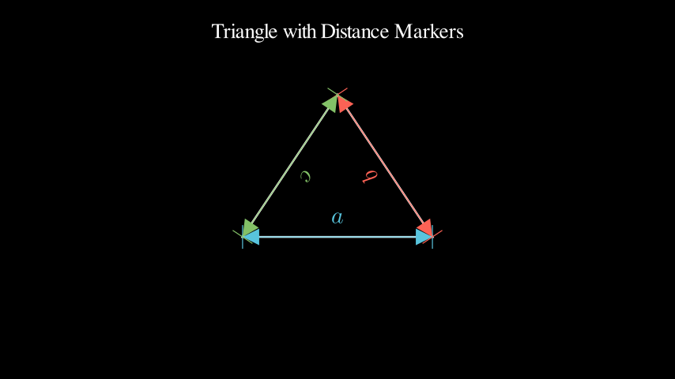
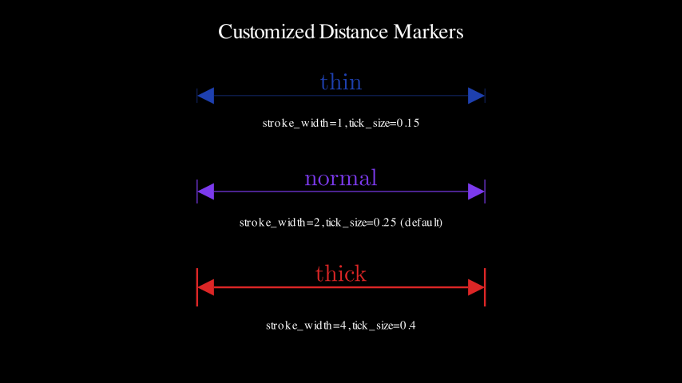
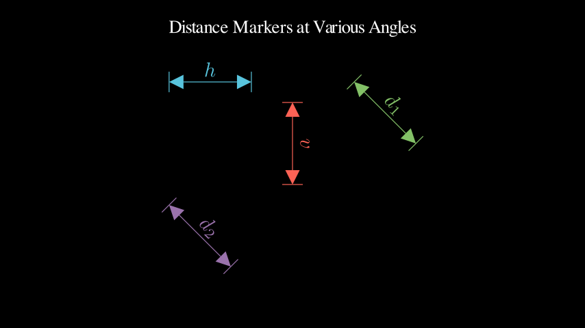
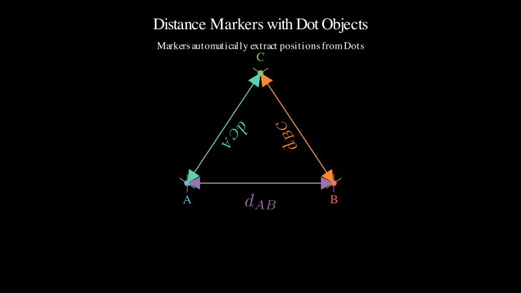
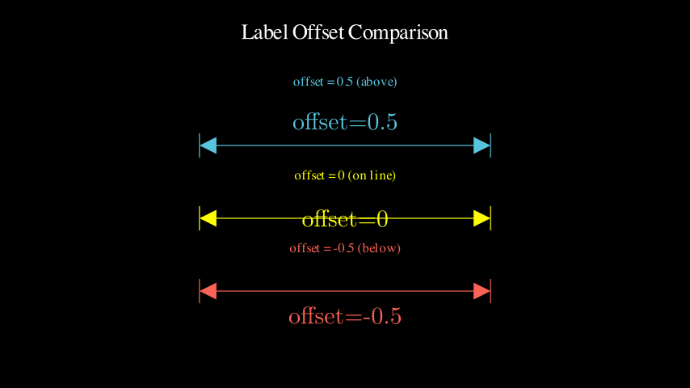
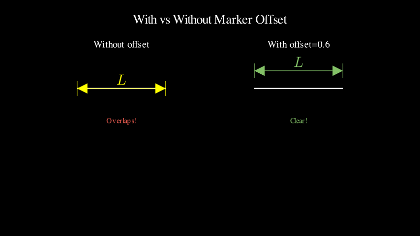
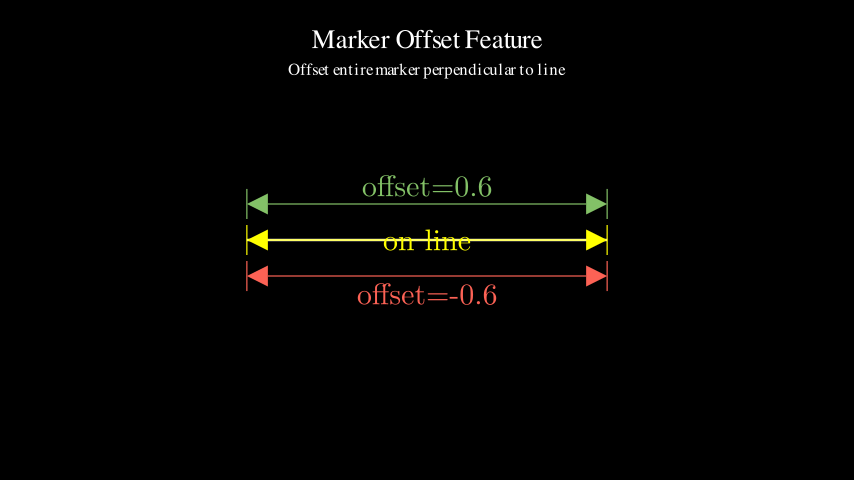

# Annotation Demos

Demonstrations of `distance_marker()` function for geometric annotations.

> 💡 **Note**: Click on video links below to download and watch. Screenshots are displayed inline.

---

## BasicDistanceMarker
**Simple distance marker between two points**

📹 [Download Video (MP4)](BasicDistanceMarker.mp4)

---

## DistanceMarkerCustomization
**Different stroke widths: thin, normal, thick**

📹 [Download Video (MP4)](DistanceMarkerCustomization.mp4)

---

## DistanceMarkerOrientations
**Horizontal and vertical orientations**

📹 [Download Video (MP4)](DistanceMarkerOrientations.mp4)

---

## DistanceMarkerRectangle
**Annotating rectangle dimensions**

📹 [Download Video (MP4)](DistanceMarkerRectangle.mp4)

---

## DistanceMarkerWithDots
**Markers with endpoint dots**

📹 [Download Video (MP4)](DistanceMarkerWithDots.mp4)

---

## LabelOffsetComparison
**Comparing different label offset values**

📹 [Download Video (MP4)](LabelOffsetComparison.mp4)

---

## MarkerOffsetComparison
**Comparing different marker offset values**

📹 [Download Video (MP4)](MarkerOffsetComparison.mp4)

---

## MarkerOffsetExample
**Basic marker offset demonstration**

📹 [Download Video (MP4)](MarkerOffsetExample.mp4)

---

## MarkerOffsetPractical
**Practical use case with rectangle dimensions**

📹 [Download Video (MP4)](MarkerOffsetPractical.mp4)

---

## PythagoreanTheorem
**Complete example: annotated right triangle with theorem**

📹 [Download Video (MP4)](PythagoreanTheorem.mp4)
