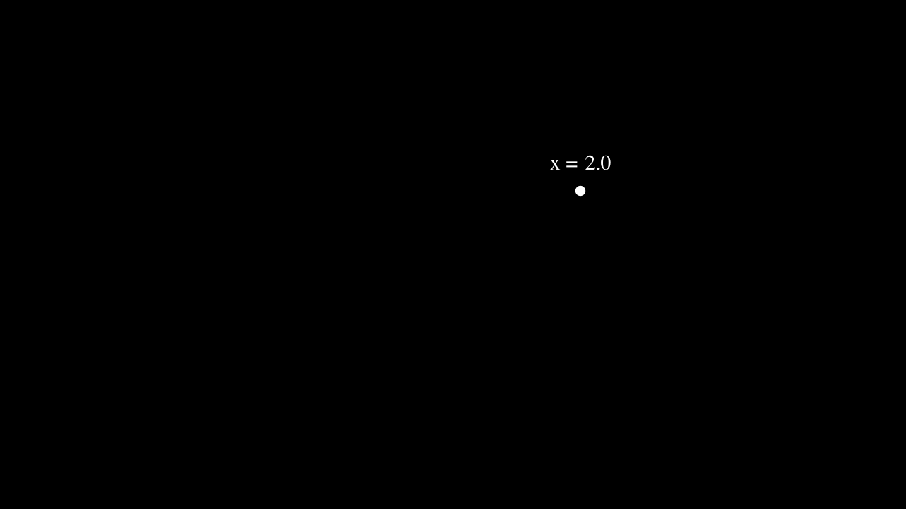
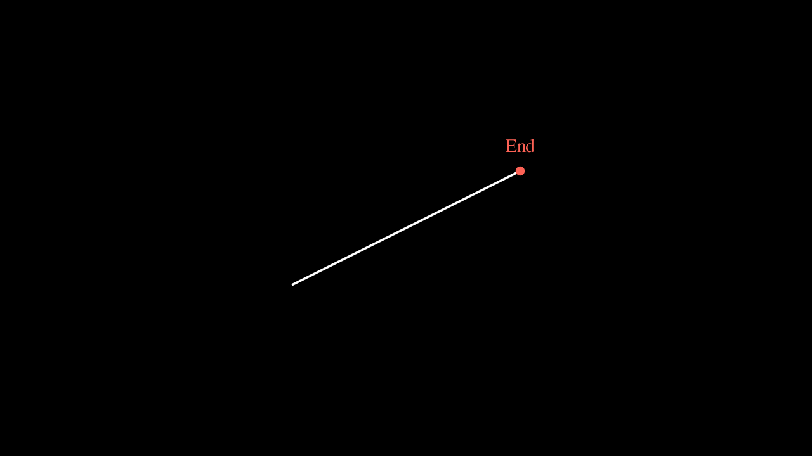
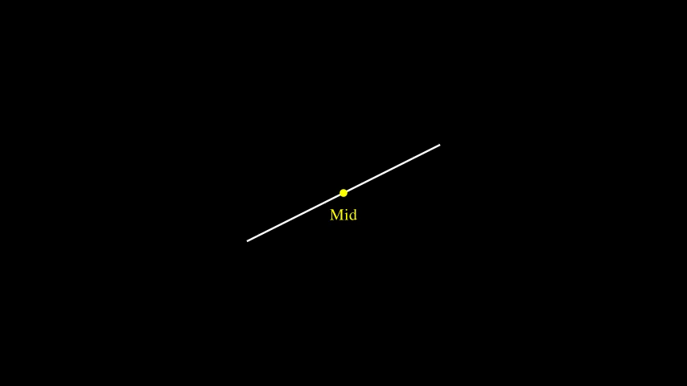
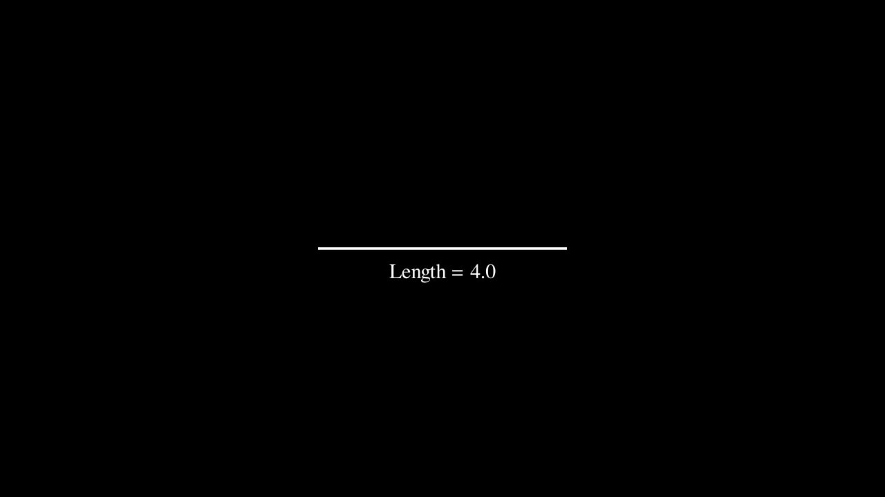
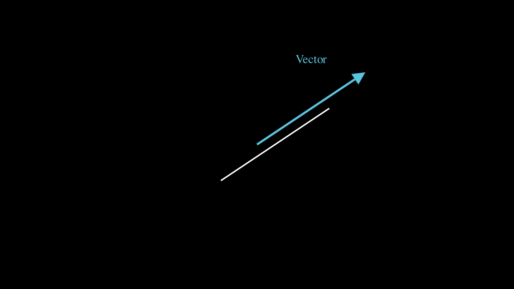
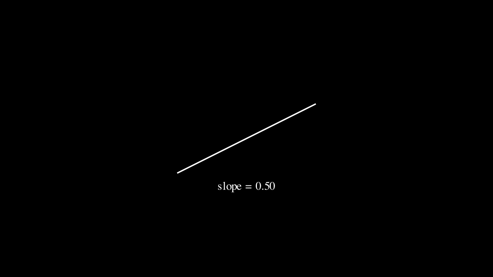
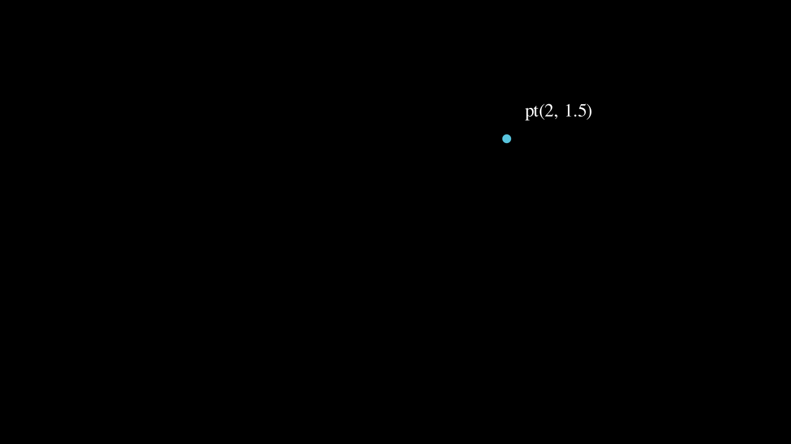
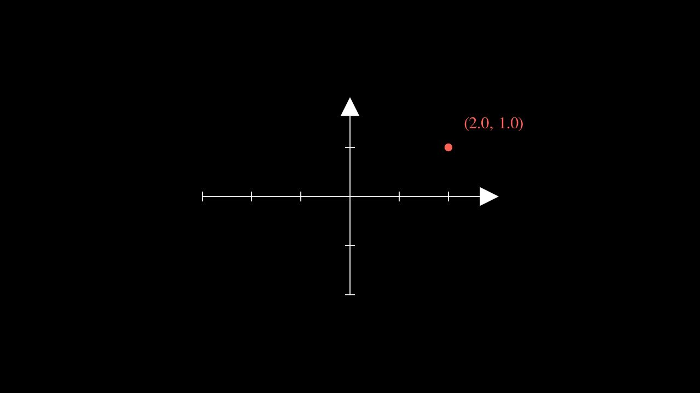
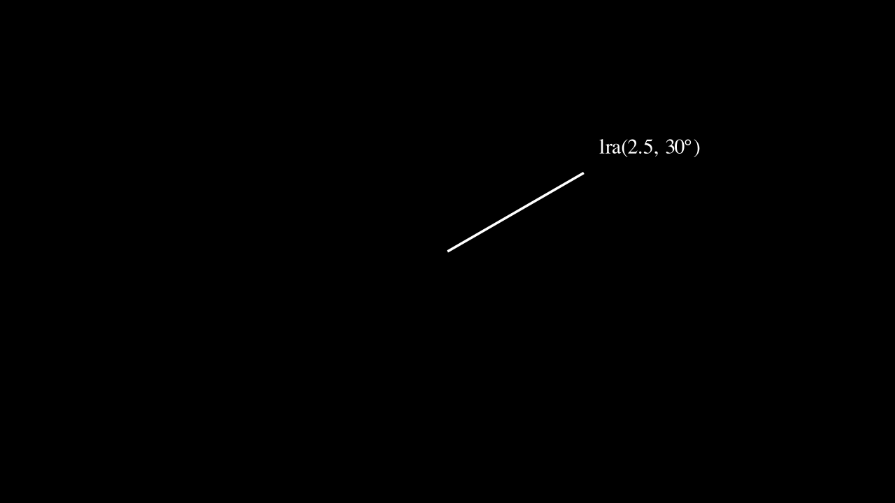
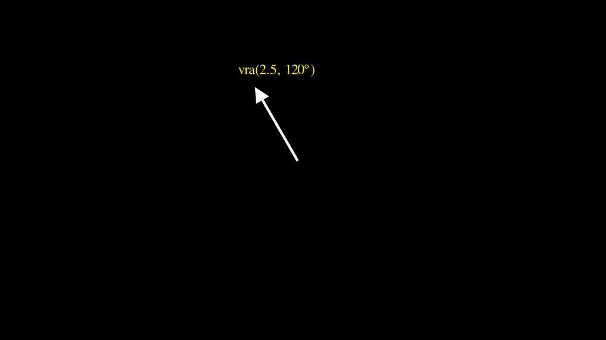

# Exp Utilities Documentation

A comprehensive collection of utility functions for working with Manim objects, coordinates, and geometric primitives.

## Table of Contents

1. [Coordinate Extraction](#coordinate-extraction)
   - [x()](#x---extract-x-coordinate)
   - [y()](#y---extract-y-coordinate)
2. [Point Access](#point-access)
   - [st()](#st---get-start-point)
   - [ed()](#ed---get-end-point)
   - [mid()](#mid---get-center-point)
3. [Vector Properties](#vector-properties)
   - [mag()](#mag---get-magnitudelength)
   - [uv()](#uv---get-unit-vector)
   - [vec()](#vec---get-vector)
   - [ang()](#ang---get-angle)
   - [slope()](#slope---get-slope)
4. [Value Extraction](#value-extraction)
   - [val()](#val---get-value-from-tracker)
5. [Point Creation](#point-creation)
   - [pt()](#pt---create-point)
6. [Coordinate Conversion](#coordinate-conversion)
   - [m2v()](#m2v---model-to-view)
   - [v2m()](#v2m---view-to-model)
   - [x2v()](#x2v---x-value-to-graph-point)
7. [Line Creation](#line-creation)
   - [vl()](#vl---vertical-line)
   - [hl()](#hl---horizontal-line)
   - [lra()](#lra---line-with-radius-and-angle-polar)
8. [Arrow Creation](#arrow-creation)
   - [vra()](#vra---arrow-with-radius-and-angle-polar)
9. [Proportional Points](#proportional-points)
   - [r2p()](#r2p---dot-at-proportion)

---

## Coordinate Extraction

### x() - Extract x-coordinate

Extract the x-coordinate from various object types (Dot, VMobject, numpy array, or list).

```python
from robo_manim_add_ons import x

dot = Dot(pt(2, 1))
x_val = x(dot)  # Returns 2.0
```


[Video](XDemo.mp4)

---

### y() - Extract y-coordinate

Extract the y-coordinate from various object types.

```python
from robo_manim_add_ons import y

dot = Dot(pt(1, 2))
y_val = y(dot)  # Returns 2.0
```


[Video](YDemo.mp4)

---

## Point Access

### st() - Get start point

Get the start point of a line or other object with `get_start()` method.

```python
from robo_manim_add_ons import st

line = Line(pt(-2, -1), pt(2, 1))
start_point = st(line)  # Returns np.array([-2, -1, 0])
```


[Video](StDemo.mp4)

---

### ed() - Get end point

Get the end point of a line or other object with `get_end()` method.

```python
from robo_manim_add_ons import ed

line = Line(pt(-2, -1), pt(2, 1))
end_point = ed(line)  # Returns np.array([2, 1, 0])
```


[Video](EdDemo.mp4)

---

### mid() - Get center point

Get a Dot at the center of an object with `get_center()` method.

```python
from robo_manim_add_ons import mid

line = Line(pt(-2, -1), pt(2, 1))
center_dot = mid(line)  # Returns Dot at center
```


[Video](MidDemo.mp4)

---

## Vector Properties

### mag() - Get magnitude/length

Get the magnitude/length from lines, vectors, or arrays.

```python
from robo_manim_add_ons import mag

line = Line(pt(-2, 0), pt(2, 0))
length = mag(line)  # Returns 4.0
```


[Video](MagDemo.mp4)

---

### uv() - Get unit vector

Get the unit vector (normalized direction) from lines or vectors.

```python
from robo_manim_add_ons import uv

line = Line(ORIGIN, pt(3, 3))
unit = uv(line)  # Returns normalized vector
```


[Video](UvDemo.mp4)

---

### vec() - Get vector

Get the vector representation (end - start) from a line.

```python
from robo_manim_add_ons import vec

line = Line(pt(-1, -1), pt(2, 1))
vector = vec(line)  # Returns np.array([3, 2, 0])
```


[Video](VecDemo.mp4)

---

### ang() - Get angle

Get the angle in radians from lines or vectors.

```python
from robo_manim_add_ons import ang

line = Line(ORIGIN, pt(2, 2))
angle_rad = ang(line)  # Returns π/4 (45 degrees)
```


[Video](AngDemo.mp4)

---

### slope() - Get slope

Get the slope (rise/run) from lines or vectors.

```python
from robo_manim_add_ons import slope

line = Line(pt(-2, -1), pt(2, 1))
slp = slope(line)  # Returns 0.5
```


[Video](SlopeDemo.mp4)

---

## Value Extraction

### val() - Get value from tracker

Extract values from ValueTracker or similar objects with `get_value()` method.

```python
from robo_manim_add_ons import val

tracker = ValueTracker(3.14)
value = val(tracker)  # Returns 3.14
```


[Video](ValDemo.mp4)

---

## Point Creation

### pt() - Create point

Create a point as numpy array from x, y, z coordinates (z defaults to 0).

```python
from robo_manim_add_ons import pt

point = pt(2, 1.5)  # Returns np.array([2, 1.5, 0])
dot = Dot(point)
```


[Video](PtDemo.mp4)

---

## Coordinate Conversion

### m2v() - Model to view

Convert model coordinates to view (screen) coordinates and return as a Dot.

```python
from robo_manim_add_ons import m2v

axes = Axes(x_range=[-3, 3], y_range=[-2, 2])
dot = m2v(axes, 2, 1)  # Returns Dot at screen coordinates for (2, 1) in model space
```


[Video](M2vDemo.mp4)

---

### v2m() - View to model

Convert view (screen) coordinates to model coordinates and return as a Dot.

```python
from robo_manim_add_ons import v2m

axes = Axes(x_range=[-3, 3], y_range=[-2, 2])
dot = v2m(axes, 2, 1)  # Returns Dot at model coordinates for screen point (2, 1)
```


[Video](V2mDemo.mp4)

---

### x2v() - X-value to graph point

Get a Dot on a graph at a given x-value.

```python
from robo_manim_add_ons import x2v

axes = Axes(x_range=[-5, 5], y_range=[-5, 5])
parabola = axes.plot(lambda x: x**2)
dot = x2v(axes, parabola, 2)  # Returns Dot on parabola at x=2
```


[Video](X2vDemo.mp4)

---

## Line Creation

### vl() - Vertical line

Create a vertical line at x-coordinate from y1 to y2.

```python
from robo_manim_add_ons import vl

line = vl(1, -2, 2)  # Vertical line at x=1 from y=-2 to y=2
```


[Video](VlDemo.mp4)

---

### hl() - Horizontal line

Create a horizontal line at y-coordinate from x1 to x2.

```python
from robo_manim_add_ons import hl

line = hl(1, -2, 2)  # Horizontal line at y=1 from x=-2 to x=2
```


[Video](HlDemo.mp4)

---

### lra() - Line with radius and angle (polar)

Create a line using polar coordinates (radius/length and angle in degrees).

```python
from robo_manim_add_ons import lra

line = lra(2.5, 30)      # Line from origin, radius 2.5, at 30°
line = lra(3, 45, 1, 1)  # Line from (1,1), radius 3, at 45°
```


[Video](LraDemo.mp4)

---

## Arrow Creation

### vra() - Arrow with radius and angle (polar)

Create an arrow using polar coordinates (radius/length and angle in degrees).

```python
from robo_manim_add_ons import vra

arrow = vra(2.5, 120)    # Arrow from origin, radius 2.5, at 120°
arrow = vra(3, 60, 1, 1) # Arrow from (1,1), radius 3, at 60°
```


[Video](VraDemo.mp4)

---

## Proportional Points

### r2p() - Dot at proportion

Get a Dot at a specified proportion along an object (0 = start, 1 = end).

```python
from robo_manim_add_ons import r2p

line = Line(pt(-3, -1), pt(3, 2))
dot_mid = r2p(line, 0.5)  # Dot at midpoint
dot_quarter = r2p(line, 0.25)  # Dot at 25%
```


[Video](R2pDemo.mp4)

---

## Complete Import

Import all exp utilities at once:

```python
from robo_manim_add_ons import (
    x, y, st, ed, mid, mag, uv, vec, ang, slope, val,
    pt, m2v, v2m, x2v, vl, hl, lra, vra, r2p
)
```

## Notes

- All angle parameters are in **degrees** (converted to radians internally)
- Functions with `from_x` and `from_y` parameters default to `(0, 0)`
- All functions are designed to work seamlessly with Manim objects
- `pt()` always returns `np.array([x, y, z])` with z defaulting to 0
- Coordinate conversion functions (`m2v`, `v2m`, `x2v`) return **Dot** objects, not numpy arrays
- Functions like `mid()` and `r2p()` also return **Dot** objects for convenience
