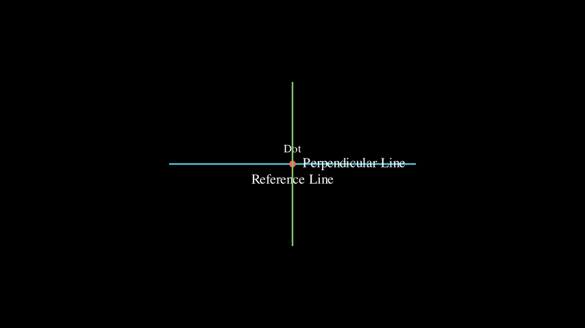
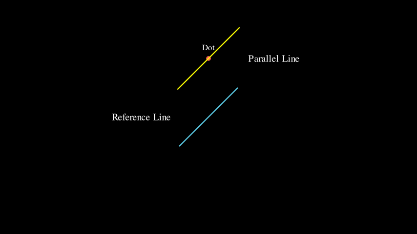
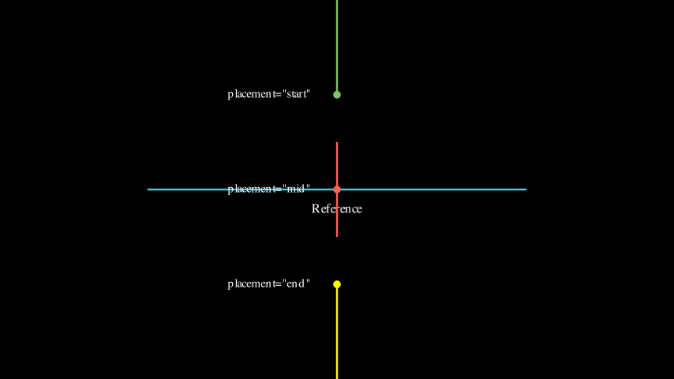
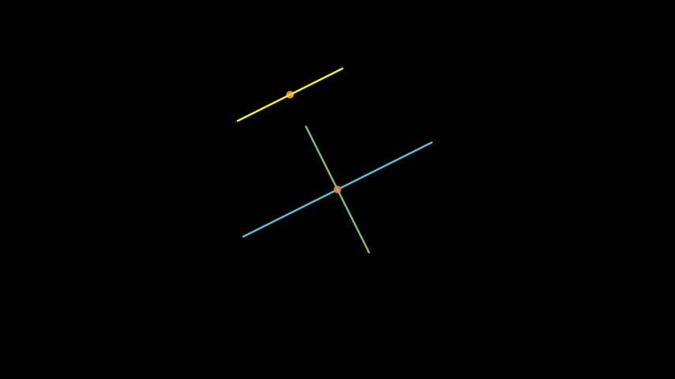
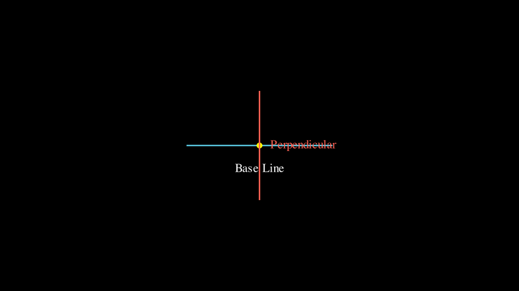
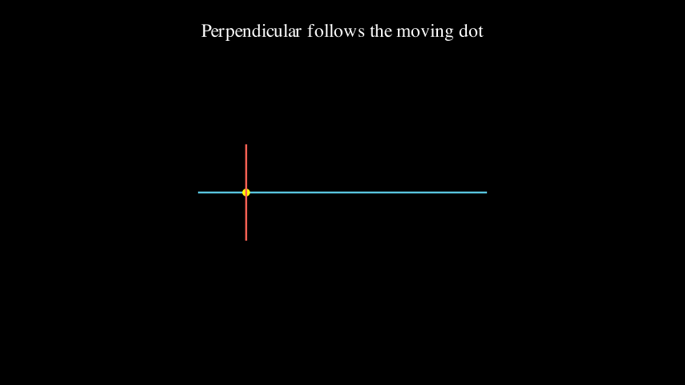
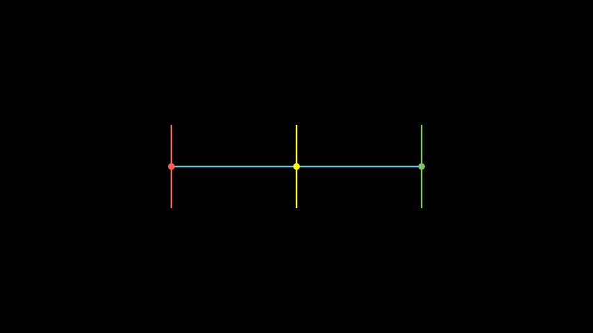
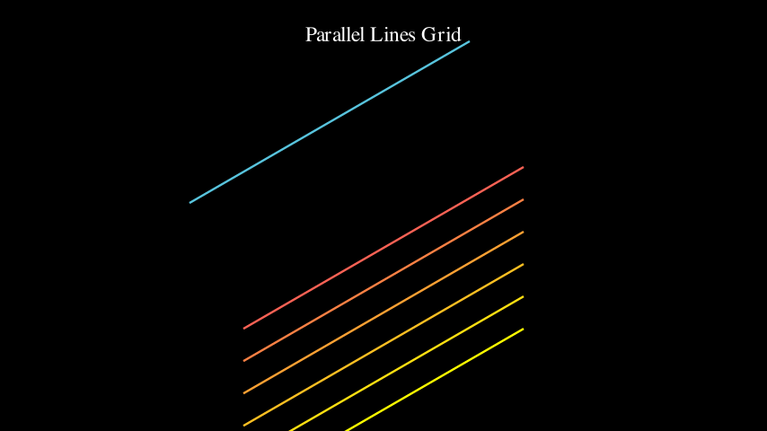
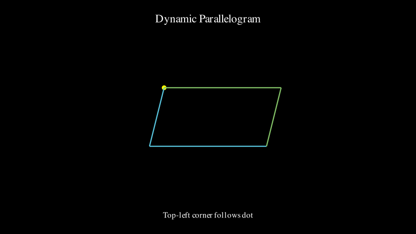

# Geometry Demos

Demonstrations of `perp()`, `parallel()`, `project()`, and `reflect()` functions.

> 💡 **Note**: Click on video links below to download and watch. Screenshots are displayed inline.

---

## PerpDemo
**Basic perpendicular line construction**

📹 [Download Video (MP4)](PerpDemo.mp4)

---

## ParallelDemo
**Basic parallel line construction**

📹 [Download Video (MP4)](ParallelDemo.mp4)

---

## PlacementDemo
**Different placement options: start, mid, end**

📹 [Download Video (MP4)](PlacementDemo.mp4)

---

## GeometryComboDemo
**Combining perpendicular and parallel lines**

📹 [Download Video (MP4)](GeometryComboDemo.mp4)

---

## DynamicPerpExample
**Perpendicular line updating as base line rotates**

📹 [Download Video (MP4)](DynamicPerpExample.mp4)

---

## DynamicParallelExample
**Parallel line following a moving reference line**

📹 [Download Video (MP4)](DynamicParallelExample.mp4)

---

## InteractivePerpUpdater
**Perpendicular following a moving point**

📹 [Download Video (MP4)](InteractivePerpUpdater.mp4)

---

## MultiplePerpendicularUpdaters
**Multiple perpendiculars at different positions**

📹 [Download Video (MP4)](MultiplePerpendicularUpdaters.mp4)

---

## ParallelLinesGrid
**Grid of parallel lines with dynamic updates**

📹 [Download Video (MP4)](ParallelLinesGrid.mp4)

---

## ParallelogramUpdater
**Dynamic parallelogram construction**

📹 [Download Video (MP4)](ParallelogramUpdater.mp4)
