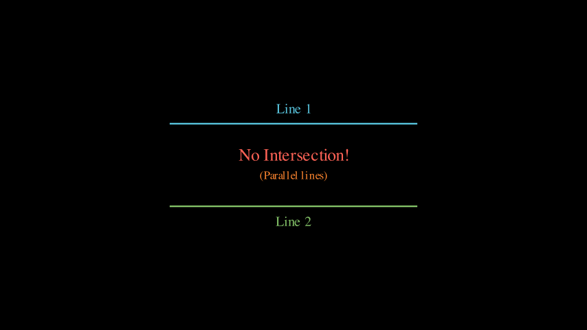
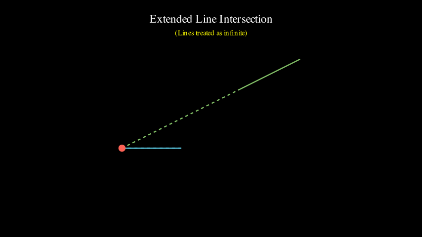
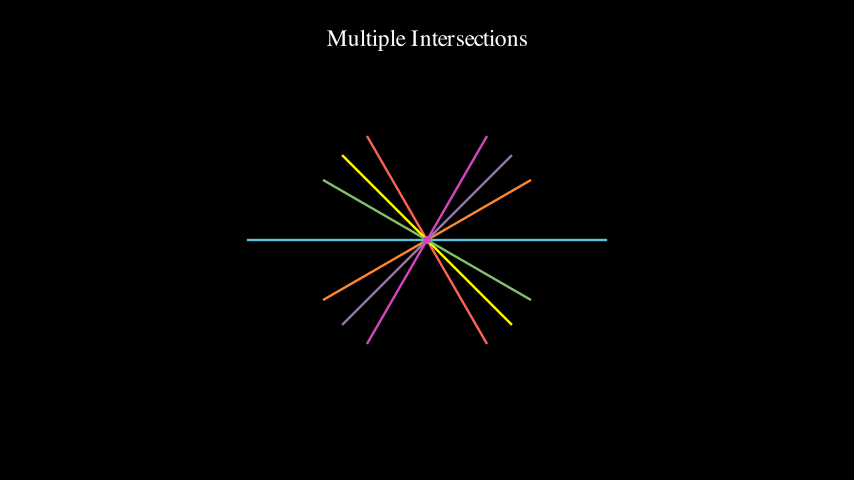
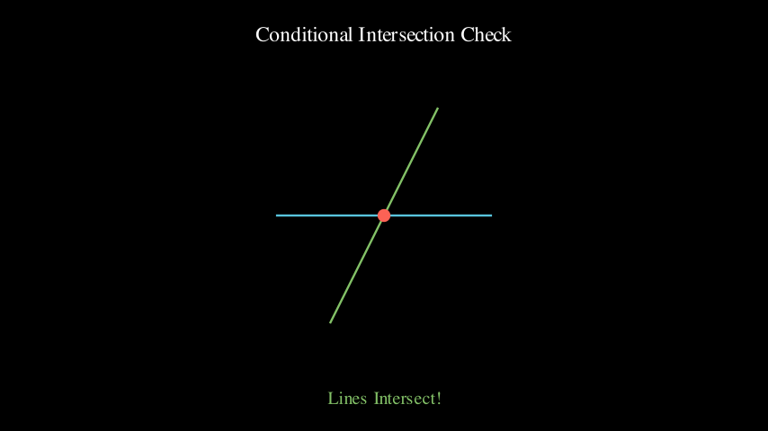
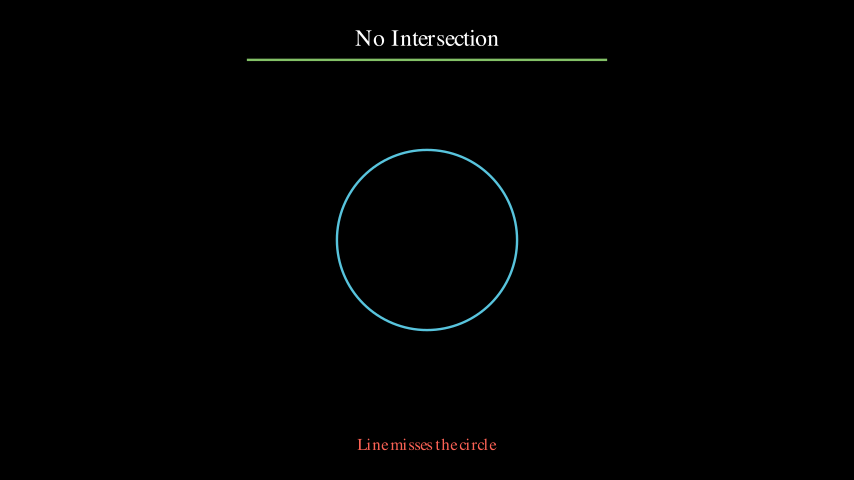
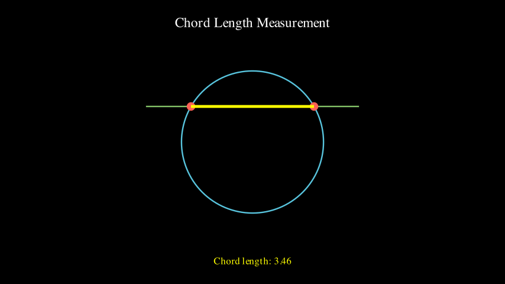

# Intersection Demos

Demonstrations of `intersect_lines()` and `intersect_line_circle()` functions.

---

## Line-Line Intersections

### BasicIntersectionDemo
Simple perpendicular line intersection.

[▶️ Watch Video](BasicIntersectionDemo.mp4)

---

### DiagonalIntersectionDemo
Diagonal lines forming an X.

[▶️ Watch Video](DiagonalIntersectionDemo.mp4)

---

### ParallelLinesDemo
Parallel lines (no intersection).

[▶️ Watch Video](ParallelLinesDemo.mp4)

---

### ExtendedIntersectionDemo
Lines extended infinitely to intersect.

[▶️ Watch Video](ExtendedIntersectionDemo.mp4)

---

### DynamicIntersectionDemo
Intersection following a rotating line.

[▶️ Watch Video](DynamicIntersectionDemo.mp4)

---

### MultipleIntersectionsDemo
Multiple lines intersecting one line.

[▶️ Watch Video](MultipleIntersectionsDemo.mp4)

---

### TriangleIntersectionDemo
Finding triangle orthocenter.

[▶️ Watch Video](TriangleIntersectionDemo.mp4)

---

### ConditionalIntersectionDemo
Checking if intersection exists.

[▶️ Watch Video](ConditionalIntersectionDemo.mp4)

---

## Line-Circle Intersections

### BasicLineCircleIntersection
Line through circle center (2 intersection points).

[▶️ Watch Video](BasicLineCircleIntersection.mp4)

---

### TangentLineDemo
Tangent line to circle (1 intersection point).

[▶️ Watch Video](TangentLineDemo.mp4)

---

### NoIntersectionDemo
Line missing circle (0 intersection points).

[▶️ Watch Video](NoIntersectionDemo.mp4)

---

### DynamicLineCircleIntersection
Intersections following a rotating line.

[▶️ Watch Video](DynamicLineCircleIntersection.mp4)

---

### MultipleCirclesIntersection
Line through multiple circles.

[▶️ Watch Video](MultipleCirclesIntersection.mp4)

---

### ChordLengthDemo
Measuring chord length from intersections.

[▶️ Watch Video](ChordLengthDemo.mp4)

---

### DiameterDemo
Comparing diameter vs chord lengths.

[▶️ Watch Video](DiameterDemo.mp4)
