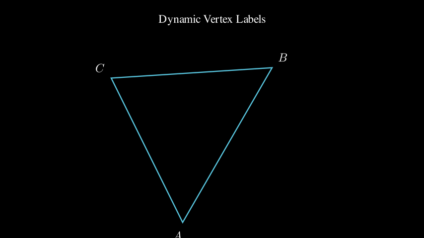
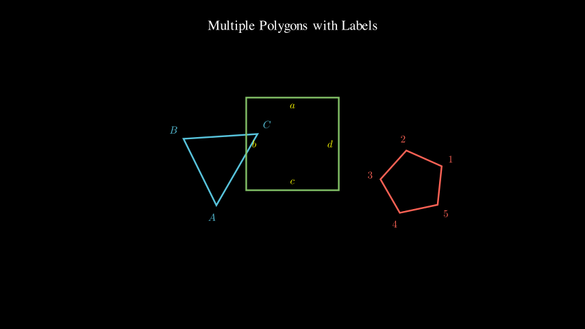

# Label Demos

Demonstrations of `vertex_labels()` and `edge_labels()` functions.

> 💡 **Note**: Click on video links below to download and watch. Screenshots are displayed inline.

---

## DynamicVertexLabelsExample
**Vertex labels following a transforming triangle**

📹 [Download Video (MP4)](DynamicVertexLabelsExample.mp4)

---

## DynamicEdgeLabelsExample
**Edge labels on a transforming square**

📹 [Download Video (MP4)](DynamicEdgeLabelsExample.mp4)

---

## DynamicVertexAndEdgeLabels
**Both vertex and edge labels on a pentagon**

📹 [Download Video (MP4)](DynamicVertexAndEdgeLabels.mp4)

---

## MorphingPolygonLabels
**Labels following a morphing polygon**

📹 [Download Video (MP4)](MorphingPolygonLabels.mp4)

---

## InteractivePolygonWithUpdater
**Labels showing real-time edge lengths**

📹 [Download Video (MP4)](InteractivePolygonWithUpdater.mp4)

---

## AnimatedLabelColors
**Dynamic color interpolation for labels**

📹 [Download Video (MP4)](AnimatedLabelColors.mp4)

---

## MultiplePolygonsWithLabels
**Multiple polygons with independent labels**

📹 [Download Video (MP4)](MultiplePolygonsWithLabels.mp4)
