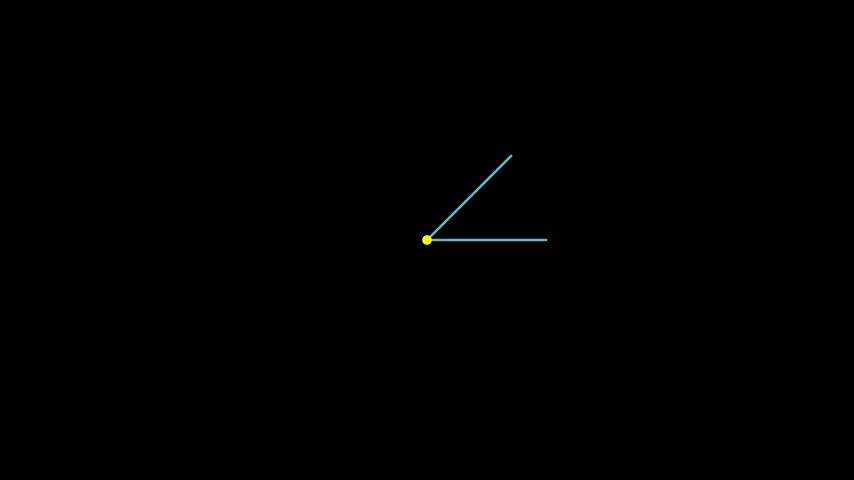
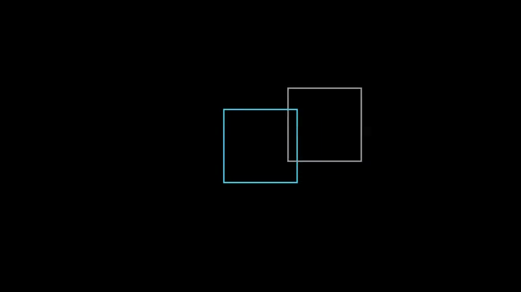
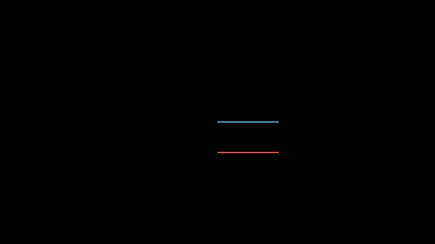
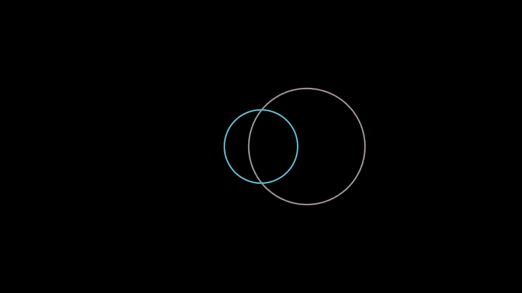

# Transform Utilities Demos

Transform utilities provide copy-and-transform operations for Manim objects. These functions create modified copies without changing the original objects.

## Available Functions

- `translated(obj, dx, dy)` - Create a translated copy
- `rotated(obj, angle_in_degrees, about)` - Create a rotated copy
- `scaled(obj, scale_factor, about)` - Create a scaled copy

## Updater Examples

Updater examples demonstrate objects that automatically update based on changes to a reference object.

### TranslatedUpdaterExample

[](TranslatedUpdaterExample.mp4)

A follower square maintains a constant offset (2 right, 1 up) from a moving reference square.

```python
from manim import *
from robo_manim_add_ons import translated

class TranslatedUpdaterExample(Scene):
    def construct(self):
        # Create a reference square that will move
        ref_square = Square(color=BLUE).shift(LEFT * 3)

        # Create a follower square that uses updater to stay translated
        follower = Square(color=RED)
        follower.add_updater(
            lambda m: m.become(translated(ref_square, 2, 1))
        )

        self.add(ref_square, follower)
        self.play(ref_square.animate.shift(RIGHT * 2 + UP))
        self.play(ref_square.animate.shift(DOWN * 2))
        self.wait()
```

### RotatedUpdaterExample

[](RotatedUpdaterExample.mp4)

A follower line stays rotated 45 degrees from a rotating reference line.

```python
from manim import *
from robo_manim_add_ons import rotated

class RotatedUpdaterExample(Scene):
    def construct(self):
        # Create a reference line that will rotate
        ref_line = Line(ORIGIN, RIGHT * 2, color=BLUE)
        center_dot = Dot(ORIGIN, color=YELLOW)

        # Create a follower line that stays rotated by 45 degrees
        follower = Line(ORIGIN, RIGHT * 2, color=RED)
        follower.add_updater(
            lambda m: m.become(rotated(ref_line, 45, center_dot))
        )

        self.add(ref_line, follower, center_dot)
        self.play(Rotate(ref_line, PI, about_point=ORIGIN))
        self.wait()
```

### ScaledUpdaterExample

[](ScaledUpdaterExample.mp4)

A follower circle is always 2x the size of a reference circle.

```python
from manim import *
from robo_manim_add_ons import scaled

class ScaledUpdaterExample(Scene):
    def construct(self):
        # Create a reference circle that will scale
        ref_circle = Circle(radius=0.5, color=BLUE).shift(LEFT * 2)

        # Create a follower circle that is always 2x the size
        follower = Circle(radius=0.5, color=RED)
        follower.add_updater(
            lambda m: m.become(scaled(ref_circle, 2))
        )

        self.add(ref_circle, follower)
        self.play(ref_circle.animate.scale(2))
        self.play(ref_circle.animate.shift(RIGHT * 2))
        self.wait()
```

## Become Examples

Become examples demonstrate transforming one object into a transformed version.

### TranslatedBecomeExample

[](TranslatedBecomeExample.mp4)

Transform an object into its translated copy.

```python
from manim import *
from robo_manim_add_ons import translated

class TranslatedBecomeExample(Scene):
    def construct(self):
        original = Square(color=BLUE)
        copy = Square(color=RED)

        self.add(original)
        self.wait(0.5)

        # Use become to transform into translated version
        self.play(copy.animate.become(translated(original, 3, 1)))
        self.add(copy)
        self.wait()
```

### RotatedBecomeExample

[](RotatedBecomeExample.mp4)

Transform an object into its rotated copy.

```python
from manim import *
from robo_manim_add_ons import rotated

class RotatedBecomeExample(Scene):
    def construct(self):
        original = Line(ORIGIN, RIGHT * 2, color=BLUE)
        copy = Line(ORIGIN, RIGHT * 2, color=RED).shift(DOWN)

        self.add(original, copy)
        self.wait(0.5)

        # Use become to transform into rotated version
        self.play(copy.animate.become(rotated(original, 90)))
        self.wait()
```

### ScaledBecomeExample

[](ScaledBecomeExample.mp4)

Transform an object into its scaled copy.

```python
from manim import *
from robo_manim_add_ons import scaled

class ScaledBecomeExample(Scene):
    def construct(self):
        original = Circle(radius=1, color=BLUE)
        copy = Circle(radius=1, color=RED).shift(RIGHT * 3)

        self.add(original, copy)
        self.wait(0.5)

        # Use become to transform into scaled version
        self.play(copy.animate.become(scaled(original, 2)))
        self.wait()
```

## Function Parameters

### translated(obj, dx, dy)
- `obj`: The Mobject to copy and translate
- `dx`: Horizontal displacement
- `dy`: Vertical displacement
- Returns: A new translated copy

### rotated(obj, angle_in_degrees, about=None)
- `obj`: The Mobject to copy and rotate
- `angle_in_degrees`: Rotation angle in degrees
- `about`: Rotation point (Dot, numpy array, or None for object's center)
- Returns: A new rotated copy

### scaled(obj, scale_factor, about=None)
- `obj`: The Mobject to copy and scale
- `scale_factor`: Scaling factor (2 = double, 0.5 = half)
- `about`: Scaling point (Dot, numpy array, or None for object's center)
- Returns: A new scaled copy
